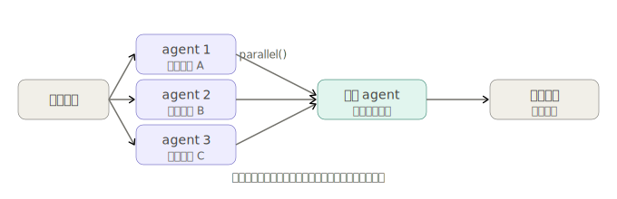
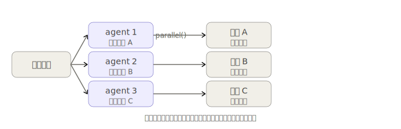
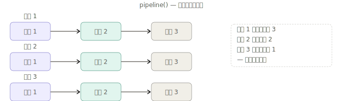
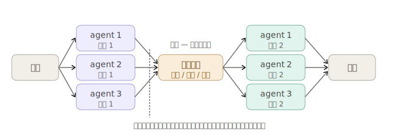
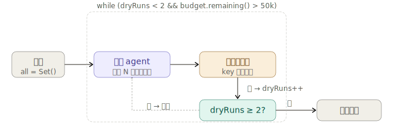
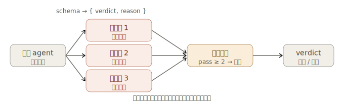
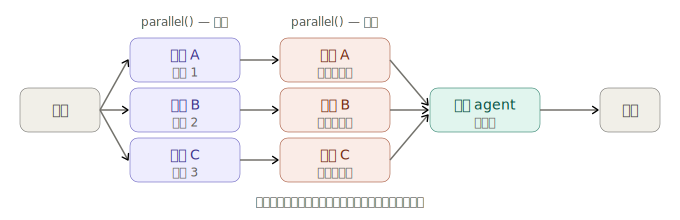

# dynamic-workflow-automation

**Claude Code skill** · 自然语言 → Workflow 脚本 → 自动执行

---

## 是什么

一个运行在 Claude Code 里的 skill，核心概念是**动态工作流**。（Workflow 是 Claude Code 内置的编排工具，通过 JS 脚本编排多个子 agent 的协作——就像 Write/Bash/Agent 一样，是 Claude Code 的原生能力，不是外部依赖。）

传统工作流工具要求你预先设计好流程、写好脚本、再触发执行。动态工作流反过来：脚本在运行时根据你的任务描述即时生成，编排模式由 skill 分析任务特征后自动选择，整个过程对你透明。「动态」体现在两个层面：

- **脚本动态生成**：不是调用预先写好的固定脚本，而是每次根据具体任务即时生成对应的 Workflow JS 脚本
- **模式动态路由**：七种编排模板不需要你指定，skill 通过分析任务的处理对象、依赖关系、汇聚方式等特征自动匹配

你只需描述任务，skill 自动完成剩下三件事：

1. 分析任务结构，匹配最合适的编排模式
2. 生成对应的 Workflow JS 脚本
3. 立即执行，把结果呈现给你

不需要你写脚本，不需要你确认脚本，描述任务就够了。



---

## 适用场景

满足以下任一条件时触发：

- 并行处理多个文件 / 数据源 / URL
- 流水线处理（多阶段，后阶段依赖前阶段结果）
- 循环发现（不确定要做多少轮，直到枯竭为止）
- 多视角验证（同一结论由多个独立 agent 交叉验证）
- 工作量明显超过单次对话的处理极限
- 你说了「用并行」「编排一下」「用工作流跑」

**不适用：** 单步简单任务、需要实时用户交互的任务。

---

## 环境要求

**仅限 Claude Code**。本 skill 依赖 Claude Code 内置的 `Workflow` 编排工具（`parallel()` / `pipeline()` / `agent()` 等运行时原语），在 claude.ai 或 API 环境中无法执行。

---

## 七种编排模式

skill 会自动分析任务并选择其中一种：

| 模式 | 适用场景 | 核心原语 |
|------|---------|---------|
| **T1 Fan-Out + 汇聚** | N 个独立对象各自处理，最后合成一份综合报告 | `parallel` + 汇聚 `agent` |
| **T2 Fan-Out 各自输出** | N 个独立对象各自处理，各自输出，不汇聚 | `parallel` |
| **T3 Pipeline 无屏障** | 每个单元经多阶段处理，阶段间无跨单元聚合 | `pipeline` |
| **T4 Pipeline + Barrier** | 阶段间需要全局去重 / 排序 / 过滤后再继续 | `parallel` × 2 + 中间聚合 |
| **T5 循环发现（3 种变体）** | 数量未知持续搜索，或已知目标数，或需独立评估完成 | `while` + budget guard |
| **T6 验证（2 种变体）** | 对抗验证（驳斥结论），或多视角验证（不同维度评估） | `parallel` + schema 投票 |
| **T7 评判小组** | 多视角生成方案，独立评审，综合选最优 | `parallel` × 2 + 综合 `agent` |

### T1 — Fan-Out + 汇聚



N 个独立单元同时处理，全部完成后由一个汇聚 agent 合成一份综合报告。最常用模式。

**完整性批评变体**（可选）：如果担心遗漏了什么维度/来源，在汇聚前加一个 agent 查漏补缺，检查结果完整性后再汇聚。

### T2 — Fan-Out 各自输出



N 个独立单元同时处理，结果各自保留，无汇聚步骤。与 T1 的唯一区别是省略了最后的合并 agent。

### T3 — Pipeline（无屏障）



每个单元独立穿过所有阶段，前一单元完成第 N 阶段后即可进入第 N+1 阶段，不等其他单元。阶段间无跨单元操作。选 T3 还是 T4 的判据：阶段切换时需要拿到**所有单元的结果**才能继续？不需要 → T3，需要 → T4。

**屏障合理的 3 种场景**（选 T4）：① 在昂贵下游工作前对整个结果集去重/合并；② 总数为零时提前退出（"0 个结果 → 跳过全部"）；③ Stage 的 prompt 需要引用"其他发现"做比较。
**屏障不合理的 3 种场景**（应选 T3）：① 只是先 flatten/map/filter 再继续——在 pipeline 的 stage 内部做就行；② 觉得阶段"概念上是分开的"——分开的阶段 ≠ 同步的阶段；③ 觉得"代码更干净"——屏障延迟真实存在，5 个任务最慢比最快慢 3 倍，屏障浪费 2/3。

### T4 — Pipeline + Barrier



阶段 1 并行完成后设屏障，在全部结果上做去重 / 排序 / 过滤等跨单元操作，再进入阶段 2。判据：阶段切换时是否必须拿到所有单元结果才能继续？是 → T4，否 → T3。

### T5 — 循环发现（3 种变体）



**变体 A — Loop-Until-Dry**（如图）：数量未知，持续搜索直到连续 2 轮无新 key。
```
┌──────┐  搜索   ┌───────┐  结果   ┌──────────┐
│ agent │ ─────→ │ 去重   │ ─────→ │ 空转检查  │ ── 空转2轮 ──→ 退出
└──────┘        └───────┘         └──────────┘
    ↑                                      │
    └────────── 还有新发现？继续 ────────────┘
```

**变体 B — Loop-Until-Count**：明确知道目标数量（如"找 10 个案例"），数量够了就停。
```
┌──────┐  搜索   ┌───────────┐
│ agent │ ─────→ │ found < N │ ── 已满 ──→ 退出
└──────┘        └───────────┘
    ↑                │ 未满
    └────────────────┘
```

**变体 C — Loop-Until-Evaluator**：由独立的评估 agent 判断工作是否完成，适合完成标准不单是数量而是质量的场景。
```
┌──────┐ ──→ ┌──────────┐ ──→ ┌──────────┐
│ work │    │ evaluator │    │ 通过？    │ ── 是 ──→ 退出
│ agent│    │           │    │          │
└──────┘ ←──└──────────┘ ←──└──────────┘
                feedback         │ 否
                                └→ 继续迭代 → work agent
```
⚠️ 风险：若 `budget.total` 未设置（为 null），且 evaluator 持续返回 `done: false`，循环会一直运行直到 1000 agent 上限。建议始终设 budget 或在 evaluator schema 中加入明确的终止条件（如最大轮次字段）。
所有变体均内置 budget guard，预算耗尽时优雅退出，已有结果不丢失。

### T6 — 验证（2 种变体）



**变体 A — 对抗验证**（如图）：多个独立验证者以相同标准尝试反驳同一结论。通过 schema 强制输出 `verdict: "pass"|"reject"`，在结构化字段上计票，≥2 票 pass 则通过。
```
                  ┌────────────┐
                  │ 验证者 1    │ ──→ pass / reject
结论 ──→ parallel ┼────────────┤
                  │ 验证者 2    │ ──→ pass / reject
                  ├────────────┤
                  │ 验证者 3    │ ──→ pass / reject
                  └────────────┘
                         ↓
                   ≥2 pass → 通过
```

**变体 B — 多视角验证**：每个验证者负责不同视角（正确性 / 安全性 / 性能 / 可复现性等），各自评分并指出问题，最后综合各视角判断。
```
                  ┌──────────────┐
                  │ 正确性视角    │ ──→ score + issues
结论 ──→ parallel ┼──────────────┤
                  │ 安全性视角    │ ──→ score + issues
                  ├──────────────┤
                  │ 性能视角      │ ──→ score + issues
                  ├──────────────┤
                  │ 可复现性视角  │ ──→ score + issues
                  └──────────────┘
                         ↓
                  平均分 + 各视角 issues 汇总
```

### T7 — 评判小组



第一轮并行从多个视角生成方案，第二轮并行对各方案独立评审打分，最后由综合 agent 根据所有评审选出最优方案（可参考其他方案优点融合）。

---

## 模式组合指南

以下组合可以直接在同一个 Workflow 脚本中拼接实现。

**Multi-modal Sweep（多模态扫描）**：T1 + 每个 agent 用不同搜索策略（按容器 / 按内容 / 按实体 / 按时间），适合单一角度可能遗漏的场景。

**发现 + 验证**：T5 变体 C 循环发现 -> 找到后接入 T6 对抗验证确认真实性。

**完整性批评 + 对抗验证**：T1 完整性批评变体检查遗漏 -> T6 验证已发现内容真实性。

---

## 文件结构

```
dynamic-workflow-automation/
├── SKILL.md                          # skill 主文件，Claude Code 读取此文件
└── references/
    ├── workflow-tool-api.md          # Workflow() 调用参数与返回值
    └── workflow-runtime-api.md       # 脚本内运行时 API（agent/parallel/pipeline 等）
```

---

## 安装

将整个目录放入你的 Claude Code skill 路径下，确保 `SKILL.md` 可被 Claude Code 读取即可。默认路径为 `~/.claude/skills/`（Windows：`%USERPROFILE%\.claude\skills\`）。

```bash
# 克隆到 skills 目录
git clone https://github.com/qscq2026/dynamic-workflow-automation.git ~/.claude/skills/dynamic-workflow-automation
```

验证安装：在 Claude Code 中输入一个并行处理任务描述，如果 skill 自动触发并生成 Workflow 脚本即安装成功。

---

## 使用示例

```
帮我并行分析这 20 份合同，提取每份的关键条款和风险点，最后汇成一份对比报告
```

```
爬取这个论坛的所有帖子 URL，不知道有多少页，一直找到没有新的为止
```

```
用三个不同视角评审这份技术方案，找出最优方案
```

```
把这批图片先分类，再对每类做风格统一，不同类别的处理互不依赖
```

```
分别搜索这 5 个数据库，各自输出结果，不需要合并（T2 Fan-Out 各自输出）
```

```
验证这份推理结论是否可靠，从正确性、安全性、性能三个角度分别评估（T6 多视角验证）
```

---

## 设计说明

### 执行原则

- **不解释、不确认，直接执行。** skill 生成脚本后立即调用 Workflow 运行，不等用户确认。
- **报错自动修正。** Workflow 执行出错时，skill 根据错误信息修正脚本后重试，不放弃 Workflow 模式。
- **结果直接呈现。** 执行完成后直接展示结果内容，不以「执行完成」结尾。

### 脚本约束

运行时沙箱的硬性限制，已内置在模板中：

| 约束 | 说明 |
|------|------|
| 禁止 `Date.now()` / `Math.random()` / 无参 `new Date()` | 破坏脚本可重放性 |
| 纯 JavaScript | 不是 TypeScript，无 Node.js API（无 `fs` / `path` / `process`） |
| 子代理无法读取主会话本地文件 | 本地文件须由主会话预读后通过 `args` 传入 |
| 最大并发 ~10 个 agent | 超出自动排队 |
| 每个 Workflow 最多 1000 个 agent 调用 | — |
| 开放循环必须内置 budget guard | T5 模板已内置，防止预算耗尽时无法优雅退出；T5 变体 C 需额外注意预算未设置时的无限循环风险 |
| 无静默上限 | 若限制了覆盖范围（top-N、采样、只处理前 K 项等），必须用 `log()` 说明丢弃了什么、为什么、可能遗漏什么 |

### 质量设计说明（与原始版本的差异）

本 skill 在以下多处做了加固，解决了模板原始设计中的已知问题：

**T6 投票判定**：验证者 agent 通过 `schema` 强制输出 `{ verdict: "pass" | "reject", reason }` 结构化字段，投票判定基于 `v.verdict === 'pass'` 而非字符串匹配，消除了对自然语言「通过」二字的依赖。

**T5 去重机制**：去重从对整段返回文本做 Set 匹配，改为对结构化 `key` 字段去重。agent 通过 schema 返回 `{ items: [{ key, data }] }`，`key` 是语义唯一标识（名称 / ID / URL），避免同一发现因表述不同被重复计入。

**T5 budget guard 分级**：每个循环变体都内置了适用的 budget guard——变体 A 用 `dryRuns < 2` 搭配预算保护，变体 B 用 `found.length < TARGET`，变体 C 用 evaluator 判断 + 预算兜底。不同循环逻辑配不同的退出条件，不做一刀切。

**T6 多视角验证**：新增变体 B，每个验证者分配独立视角（正确性 / 安全性 / 性能 / 可复现性等），覆盖不同失败模式。验证者数量可分级（普通 3 个，高风险 5 个）。

**T3/T4 barrier 决策指南**：明确列出 barrier 正确和错误的 3 种场景，减少选错模板的概率。

**T1 完整性批评变体**：在汇聚前增加可选的查漏补缺步骤，由独立 agent 评估是否遗漏了维度或来源。

**无静默上限**：若限制了覆盖范围，必须用 `log()` 说明丢弃了什么。

---

## 局限

- 强依赖 Claude Code 环境，无法跨平台运行
- 子代理数量接近 1000 时需提前规划分批策略
- T5 变体 C（Evaluator）在 `budget.total` 未设置且 evaluator 持续返回未完成时存在无限循环风险。模板已包含 budget guard，但你需确保至少设置了 budget total 或 evaluator 能在合理轮次内返回 `done: true`
- T6 / T7 的验证质量取决于 prompt 对「验证角度」的描述是否具体；T7 两轮并行会增加双倍 agent 消耗，预算敏感场景需注意
- T1 / T2 的部分子 agent 失败会返回 null，下游需做好 `filter(Boolean)` 兜底
- 模式选择依赖 Step 1 的分析质量——任务特征分析不准可能导致模板选错

---

## 与 Boris Loop / Loop Engineering 的关系

2026 年 6 月，Claude Code 创建者 **Boris Cherny** 宣告了从"写 prompt"到"写循环"的范式转变——agent 不再由人逐轮提示，而是在循环中自主运行，由独立的 evaluator 判断何时完成。Google 工程师 **Addy Osmani** 将其系统化为 **Loop Engineering**，提炼出 6 个构建模块（Automations、Worktrees、Skills、Connectors、Sub-agents、Memory）。

本 skill 对应于 Boris 三层架构中的 **Layer 3（/batch + 动态 Workflow 集群）**，是 Workflow 运行时原语（`agent()` / `parallel()` / `pipeline()`）的模板化封装。核心设计原则与 Boris Loop 一脉相承：

| 本 skill 的概念 | 对应的 Boris / Loop Engineering 概念 |
|:---------------|:-----------------------------------|
| **T5 变体 C：Loop-Until-Evaluator** | 递归式终止——子 agent 判断完成与否，不靠硬编码条件 |
| **T6 变体 B：多视角验证** | 写查分离——独立验证者从不同维度评估，不自我打分 |
| **T5/T6 的 schema 结构化输出** | 可验证性——输出必须可被程序化检查，不依赖自然语言判断 |
| **budget guard（预算保护）** | 成本意识——无限制循环比有限循环危险得多 |

**与前两层的配合方式**：Boris 的 Layer 1（`/loop` 本地循环）负责时间驱动的持续监护（如 PR 监听、CI 修复），Layer 2（Routines 云端例程）负责持久化定时任务。本 skill 的 Workflow 脚本可以由 `/loop` 触发执行，也可以在 Routine 中通过 `/batch` 调用——脚本本身不包含调度逻辑，作为"被调度的执行单元"与前两层配合，三者组合即可复现 Boris 的三层飞轮。

---

## 与 loop-engine 的比较

两个 skill 解决同一个问题域的不同层面，定位不互斥。

[loop-engine](https://github.com/qscq2026/loop-engine/) 是 prompt 模板形式的完整系统——从需求分析、YAML 配置、用户确认到 10 步执行流程和汇总报告全链路覆盖，内置质量门禁（Gate，独立 subagent 校验）、循环回退和 best-of 收敛，由模型本身作为调度者执行，无外部运行时依赖，可在任何 agent 环境下使用。

dynamic-workflow-automation 是**执行层**工具：跳过设计阶段，直接从自然语言任务描述生成可运行的 Workflow 脚本并立即执行，依赖 Claude Code 原生并发运行时，强调零摩擦的自动化。

| | dynamic-workflow-automation | loop-engine |
|---|---|---|
| **定位** | 执行层，自动生成脚本并运行 | 全链路系统，设计 + 执行 + 报告 |
| **交互模式** | 静默执行，不与用户确认 | 协作设计，问卷 + 草稿确认 |
| **并发实现** | `parallel()` 原生并发 | 模型启动多个 subagent，声明式并发 |
| **质量控制** | T6 对抗验证 / 多视角验证（可选模板） | Gate 作为一等公民，内置 double_check |
| **循环语义** | T5 3 种变体：发现型 / 计数型 / 评估型 | loop 质量不达标回退（改进型） |
| **平台依赖** | 仅限 Claude Code | 任意 agent 环境 |
| **适合场景** | 批量处理、并行爬取、多源分析 | 多阶段流程、质量驱动的迭代任务 |

两者可以组合使用：用 loop-engine 设计和把关整体流程，在需要大规模并行处理的阶段内嵌 dynamic-workflow-automation 的编排模式。

---

## License

MIT
